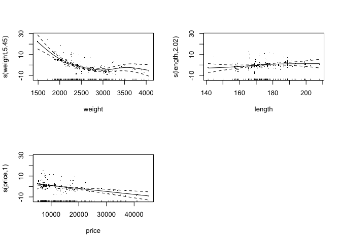
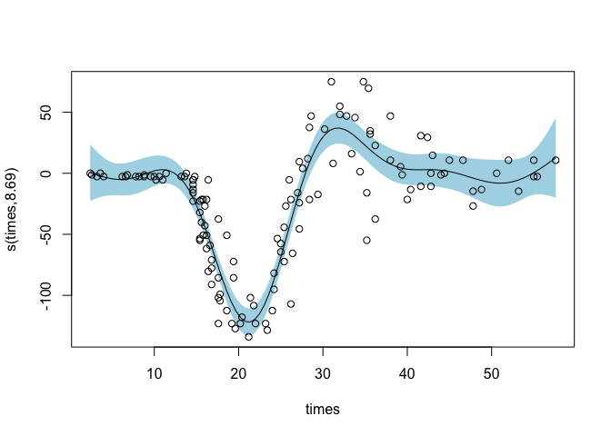
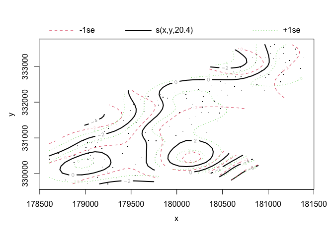
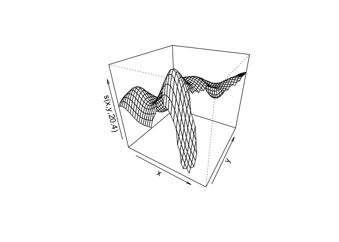
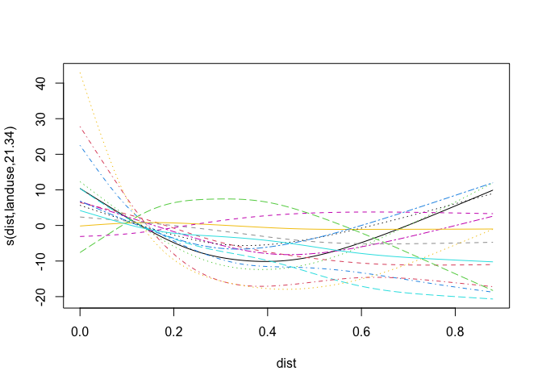
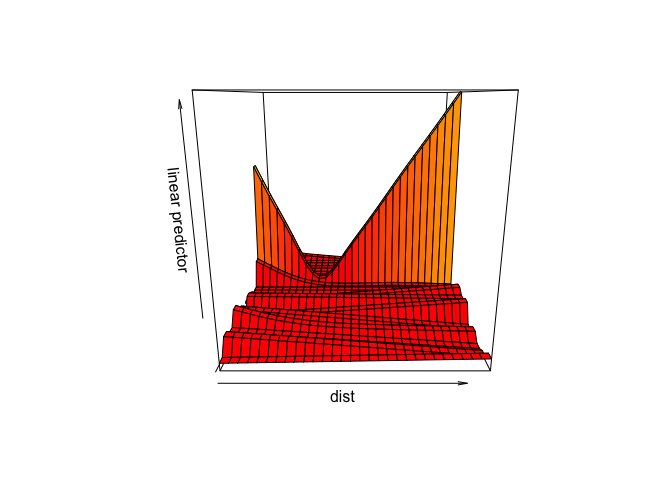
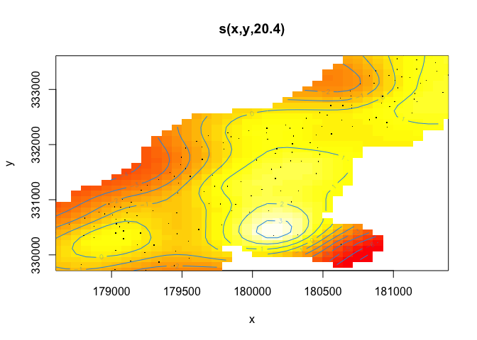
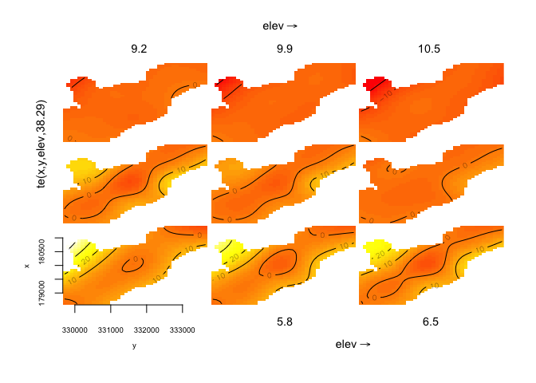
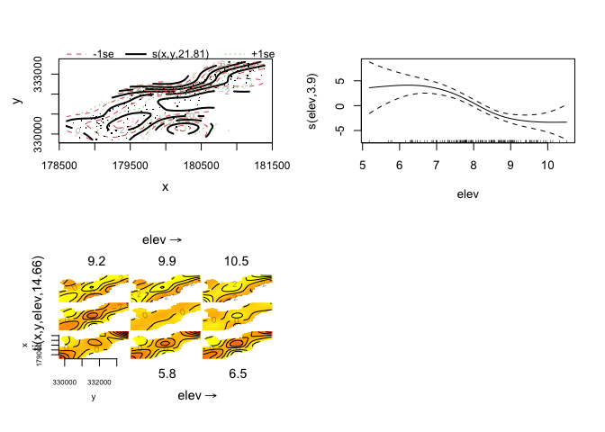

GAMs
================

-   Recap: Linear and Logistic Regression
-   Introduction to GAMs
-   Basis Functions and Smoothing
-   Multivariate Regression with GAMs
-   Interpreting GAMs
-   Visualizing GAMs
-   Model Checking
-   2D Smooths and Spatial Data
-   Plotting GAM Interactions
-   Visualizing Categorical-Continuous interactions
-   Interactions with Different Scales : Tensor Smooths

## Recap: Linear and Logistic Regression

-   model finds best fit linear line between IV and DV
-   Linear regression provides continuous output, while logistic
    regression is best for discrete classification output (eg. yes/no)

**Example using tidymodels**

``` r
example_logistic <- logistic_reg() |> set_engine("glm")

example_linear <- linear_reg() |>
  set_engine("lm") |>
  set_mode("regression")
```

**Example using motorcycle crash data**

``` r
mcycle <- MASS::mcycle

#examine mcycle data frame 
head(mcycle)
```

    ##   times accel
    ## 1   2.4   0.0
    ## 2   2.6  -1.3
    ## 3   3.2  -2.7
    ## 4   3.6   0.0
    ## 5   4.0  -2.7
    ## 6   6.2  -2.7

``` r
plot(mcycle)
```

<!-- -->

``` r
#fit a linear model and plot it 
#note that se plots standard error
lm(accel ~ times, data=mcycle) |>
  termplot(partial.resid = TRUE, se = TRUE)
```

<!-- -->

## Introduction to GAMs

<https://noamross.github.io/gams-in-r-course/>

GAMs are a middle ground between simple, highly interpretable models
(eg. linear models) and black-box machine learning. They can model
complex, nonlinear relationships but still retain clear information on
the structure of their predictions.

-   GAMs can fit data with **smooths/splines**, which are variably
    shaped functions
    -   smooths are made of many smaller **basis functions**
    -   the basis functions are summed together with varying weights
    -   this means that a single nonlinear relationship has several
        parameters, creating a more complex model than something linear
    -   coefficients for each variable can be extracted with the
        `coef()` function

**Example**

``` r
library(mgcv)
```

    ## Loading required package: nlme

    ## This is mgcv 1.8-39. For overview type 'help("mgcv-package")'.

``` r
library(ggplot2)
```

We can create a non-linear GAM model using mgcv’s `gam()` function. To
specify that we want to create a smooth relation between the IV and DV,
we encase the DV in the `s()` function.

``` r
# fit the model
gam_mod <- mgcv::gam(accel ~ s(times), data=mcycle)

# plot the results
plot(gam_mod, residuals=TRUE, pch = 1)
```

<!-- -->

``` r
# extract model coefficients
coef(gam_mod)
```

    ## (Intercept)  s(times).1  s(times).2  s(times).3  s(times).4  s(times).5 
    ##  -25.545865  -63.718008   43.475644 -110.350132  -22.181006   35.034423 
    ##  s(times).6  s(times).7  s(times).8  s(times).9 
    ##   93.176458   -9.283018 -111.661472   17.603782

`coef()` tells us that the smooth for times consists of 9 basis
functions, each with their own coefficient.

## Basis Functions and Smoothing

-   Since GAMs are so flexible, it is easy for them to become overfitted
    to the data. This makes smoothing important.
    -   **overfitting** is when the model is too finely tuned to noise
        and can’t adapt well to new data
    -   **fit = likelihood - *λ*⋅ wiggliness**
        -   finding the right *λ*, or **smoothing parameter**, is key
        -   GAMs can select their own smoothing parameter, be passed a
            specific value, or be given a method for selecting the best
            value.
        -   **REML: Restricted Maximum Likelihood** method is highly
            recommended.

``` r
# Setting a fixed smoothing parameter
gam(y ~ s(x), data = dat, sp = .1)
gam(y ~ s(x, sp = 0.1), data=dat)
# Smoothing via restricted maximum likelihood
gam(y ~s(x), data = dat, method = "REML")
```

-   A higher number of basis functions can also affect wiggliness

``` r
# Specifying number of basis functions
gam(y ~ s(x, k = 3), data = dat, method = "REML")
gam(y ~ s(x, k = 10), data = dat, method = "REML")
```

## Multivariate Regression with GAMs

``` r
# retrieving example data
library(gamair)
data("mpg", package="gamair")
```

-   We can add further variables to a model by adding them into the
    formula with a plus sign
    -   the GAM creates models for each variable and then adds them
        together

``` r
mod_city <- gam(city.mpg ~ s(weight) + s(length) + s(price), data=mpg, method = "REML")

plot(mod_city, residuals=TRUE, pages=1)
```

<!-- -->

-   Not every variable has to be wrapped in the `s()` smoothing function
    – can choose to evaluate them linearly instead
    -   in practice, all continuous variables are wrapped
    -   useful for categorical variables: creates a fixed effect for
        each level of the category

``` r
# Introducing categorical variables
mod_city2 <- gam(city.mpg ~ s(weight) + s(length) + s(price) + fuel + drive + style, data=mpg, method = "REML")

plot(mod_city2, all.terms = TRUE, residuals=TRUE, pages = 1)
```

<!-- -->

-   **Factor-smooth interaction** : GAM formulas can also fit different
    smooths for different categorical variables
    -   usually, also want to include a varying intercept in case the
        categories are different in overall means

``` r
# Using factor-smooth interaction
mod_city3 <- gam(city.mpg ~ s(weight, by=drive) + s(length, by=drive) + s(price, by=drive) + drive, data=mpg, method = "REML")

plot(mod_city3, residuals=TRUE, all.terms=TRUE, pages = 2)
```

<!-- --><!-- -->

## Interpreting GAMs

Use the `summary()` function to get a summary of model statistics.

``` r
summary(mod_city2)
```

    ## 
    ## Family: gaussian 
    ## Link function: identity 
    ## 
    ## Formula:
    ## city.mpg ~ s(weight) + s(length) + s(price) + fuel + drive + 
    ##     style
    ## 
    ## Parametric coefficients:
    ##                Estimate Std. Error t value Pr(>|t|)    
    ## (Intercept)     36.2359     1.6066  22.554   <2e-16 ***
    ## fuelgas         -9.7925     0.6267 -15.626   <2e-16 ***
    ## drivefwd        -0.5041     0.9216  -0.547   0.5851    
    ## driverwd        -0.2867     0.9678  -0.296   0.7674    
    ## stylehardtop    -1.8594     1.2883  -1.443   0.1507    
    ## stylehatchback  -2.2074     1.0607  -2.081   0.0388 *  
    ## stylesedan      -1.8152     1.1064  -1.641   0.1026    
    ## stylewagon      -1.3351     1.2374  -1.079   0.2820    
    ## ---
    ## Signif. codes:  0 '***' 0.001 '**' 0.01 '*' 0.05 '.' 0.1 ' ' 1
    ## 
    ## Approximate significance of smooth terms:
    ##             edf Ref.df      F p-value    
    ## s(weight) 6.135  7.341 12.600  <2e-16 ***
    ## s(length) 4.319  5.352  2.705  0.0202 *  
    ## s(price)  3.475  4.393  6.732   3e-05 ***
    ## ---
    ## Signif. codes:  0 '***' 0.001 '**' 0.01 '*' 0.05 '.' 0.1 ' ' 1
    ## 
    ## R-sq.(adj) =  0.879   Deviance explained = 89.1%
    ## -REML = 453.77  Scale est. = 5.0051    n = 201

-   **Family**: is model assuming a gaussian or normal distribution of
    errors?
-   **Link function:** How does the model transform predictions?
-   **Parametric coefficients:** gives coefficients, values, errors,
    etc. for linear terms in the formula
-   **Smooth terms:**
    -   **edf** - effective degrees of freedom, representing complexity
        of the smooth. 1 is linear, 2 is quadratic, etc.
    -   **Ref.df, F, p-value:** significance testing values.

## Visualizing GAMs

``` r
?plot.gam
```

plots generated by `mgcv::plot()` are **partial effect plots** that show
component effects of each term in the model.

``` r
# motorcycle model
plot(gam_mod,
     # select arg. lets you select what args to plot
     select = c(1),
     pages = 1, 
     # include linear and categorical terms
     # by default only smooth terms displayed
     all.terms = FALSE,
     # puts x values of data along bottom of plot
     rug = FALSE,
     # puts partial residuals on plots -- difference btwn partial effect and data 
     residuals = TRUE,
     pch = 1,
     cex = 1,
     # include standard error 
     se = TRUE,
     # use shading rather than lines to show se
     shade = TRUE,
     shade.col = "lightblue",
     # adds error of model intercept to better reflect overall uncertainty
     seWithMean = TRUE, 
     # shift scale by value of intercept
     # shows actual prediction of output (assuming avg value for other vars)
     shift = coef(gam_mod)[1])
```

<!-- -->

## Model Checking

We can check that we have a well-fit GAM using `gam.check()`

``` r
# checking the motorcycle model
gam.check(gam_mod)
```

<!-- -->

    ## 
    ## Method: GCV   Optimizer: magic
    ## Smoothing parameter selection converged after 8 iterations.
    ## The RMS GCV score gradient at convergence was 0.0009645413 .
    ## The Hessian was positive definite.
    ## Model rank =  10 / 10 
    ## 
    ## Basis dimension (k) checking results. Low p-value (k-index<1) may
    ## indicate that k is too low, especially if edf is close to k'.
    ## 
    ##            k'  edf k-index p-value
    ## s(times) 9.00 8.69    1.15    0.94

Ideal plot values: \* straight line \* evenly distributed around 0 \*
bell curve \* clustered around 1 to 1 line

-   **convergence**: we want the model to report finding full
    convergence. An unconverged model is probably wrong – too many
    parameters, not enough data.
-   **basis checking results**
    -   each line reports test results for 1 smooth
    -   k’ is the number of basis functions
    -   want larger p-values – small ones indicate too few basis
        functions

### Checking Concurvity

**Collinearity**: when two variables are strongly correlated, creating
problems with fitting the model. **Concurvity**: When one variable is a
smooth curve of another. This can create wild uncertainty in GAMs.

We can check for concurvity using the `concurvity(model, ...)` function.
This model has two modes.

-   **full = TRUE**
    -   Reports overall concurvity for each smooth \~ how much each
        smooth is predetermined by other functions.
    -   concern if worst case has high value (eg. > .8)

    ``` r
    concurvity(mod_city, full=TRUE)
    ```

        ##                  para s(weight) s(length)  s(price)
        ## worst    9.769453e-25 0.9384091 0.8924182 0.8835037
        ## observed 9.769453e-25 0.9208326 0.8162852 0.7926911
        ## estimate 9.769453e-25 0.8509137 0.7401133 0.6714852
-   **full = FALSE**
-   use if any values from `full=TRUE` are high
-   returns matrix of pairwise concurvities
-   can use to determine which vars have a close relationship

``` r
concurvity(mod_city, full=FALSE)
```

    ## $worst
    ##                   para    s(weight)    s(length)     s(price)
    ## para      1.000000e+00 9.890890e-26 6.876771e-27 5.349767e-25
    ## s(weight) 9.897019e-26 1.000000e+00 8.852302e-01 8.660358e-01
    ## s(length) 6.889670e-27 8.852302e-01 1.000000e+00 7.037612e-01
    ## s(price)  5.391847e-25 8.660358e-01 7.037612e-01 1.000000e+00
    ## 
    ## $observed
    ##                   para    s(weight)    s(length)     s(price)
    ## para      1.000000e+00 3.711191e-31 7.520422e-32 1.663358e-33
    ## s(weight) 9.897019e-26 1.000000e+00 8.067910e-01 7.625019e-01
    ## s(length) 6.889670e-27 8.106903e-01 1.000000e+00 5.430768e-01
    ## s(price)  5.391847e-25 8.185296e-01 6.917898e-01 1.000000e+00
    ## 
    ## $estimate
    ##                   para    s(weight)    s(length)     s(price)
    ## para      1.000000e+00 4.098771e-28 5.339695e-29 1.244130e-27
    ## s(weight) 9.897019e-26 1.000000e+00 7.264000e-01 6.339745e-01
    ## s(length) 6.889670e-27 7.270491e-01 1.000000e+00 4.488621e-01
    ## s(price)  5.391847e-25 7.316927e-01 5.487228e-01 1.000000e+00

## 2D Smooths and Spatial Data

**Interactions**

-   outcomes depend on on non-independent relationships of multiple
    variables
-   linear models represent by adding a term multiplying two variables
-   In GAMs, the relationship btwn variable and outcome changes across
    the smooth, and interactions are different across all values of two
    or more variables
    -   represent interactions between variables as a smooth surface

**Syntax**: we can model a interaction by putting two variables inside
the s() function \* interactions can be mixed with other
linear/nonlinear terms \* geospatial data \~ interaction term of x and y
coords along with individual terms for other predictors \* interactions
are modelled as a single smooth term \* have high edf bc of high number
of basis functions needed

``` r
gam(y ~ s(x1, x2) + s(x3) + x4, data = dat, method = "REML")
```

We will use a dataset `meuse`, which contains information about soil
pollution in the Netherlands

``` r
data(meuse, package="sp")

head(meuse)
```

    ##        x      y cadmium copper lead zinc  elev       dist   om ffreq soil lime
    ## 1 181072 333611    11.7     85  299 1022 7.909 0.00135803 13.6     1    1    1
    ## 2 181025 333558     8.6     81  277 1141 6.983 0.01222430 14.0     1    1    1
    ## 3 181165 333537     6.5     68  199  640 7.800 0.10302900 13.0     1    1    1
    ## 4 181298 333484     2.6     81  116  257 7.655 0.19009400  8.0     1    2    0
    ## 5 181307 333330     2.8     48  117  269 7.480 0.27709000  8.7     1    2    0
    ## 6 181390 333260     3.0     61  137  281 7.791 0.36406700  7.8     1    2    0
    ##   landuse dist.m
    ## 1      Ah     50
    ## 2      Ah     30
    ## 3      Ah    150
    ## 4      Ga    270
    ## 5      Ah    380
    ## 6      Ga    470

``` r
# modeling cadmium as a function of coordinates, elevation, and distance from the river
mod2d <- gam(cadmium ~ s(x, y) + s(elev) + s(dist), data=meuse, method = "REML")

summary(mod2d)
```

    ## 
    ## Family: gaussian 
    ## Link function: identity 
    ## 
    ## Formula:
    ## cadmium ~ s(x, y) + s(elev) + s(dist)
    ## 
    ## Parametric coefficients:
    ##             Estimate Std. Error t value Pr(>|t|)    
    ## (Intercept)   3.2458     0.1238   26.21   <2e-16 ***
    ## ---
    ## Signif. codes:  0 '***' 0.001 '**' 0.01 '*' 0.05 '.' 0.1 ' ' 1
    ## 
    ## Approximate significance of smooth terms:
    ##            edf Ref.df      F  p-value    
    ## s(x,y)  20.398 24.599  2.324 0.000852 ***
    ## s(elev)  1.282  1.496 28.868 3.78e-07 ***
    ## s(dist)  6.609  7.698 13.677  < 2e-16 ***
    ## ---
    ## Signif. codes:  0 '***' 0.001 '**' 0.01 '*' 0.05 '.' 0.1 ' ' 1
    ## 
    ## R-sq.(adj) =  0.809   Deviance explained = 84.4%
    ## -REML = 321.06  Scale est. = 2.3762    n = 155

``` r
# examining basis function coefficients
coef(mod2d)
```

    ##   (Intercept)      s(x,y).1      s(x,y).2      s(x,y).3      s(x,y).4 
    ##   3.245806452  -1.424248848   8.183058522  -7.304215631   3.779139262 
    ##      s(x,y).5      s(x,y).6      s(x,y).7      s(x,y).8      s(x,y).9 
    ##  -6.690331609  -2.289334818   8.871013764   6.720898243   1.005098231 
    ##     s(x,y).10     s(x,y).11     s(x,y).12     s(x,y).13     s(x,y).14 
    ##   3.990818733   4.132342549  -7.437426713  -7.839994796   6.870506953 
    ##     s(x,y).15     s(x,y).16     s(x,y).17     s(x,y).18     s(x,y).19 
    ##  -2.798765494   1.537266020  -1.197482173  -8.649011294   4.835857308 
    ##     s(x,y).20     s(x,y).21     s(x,y).22     s(x,y).23     s(x,y).24 
    ##   8.649339126  -4.307371070  -5.711535487  -5.088966267   7.905157210 
    ##     s(x,y).25     s(x,y).26     s(x,y).27     s(x,y).28     s(x,y).29 
    ##  -6.453641620  -1.330846470  48.104337222  -0.132715896   2.172974071 
    ##     s(elev).1     s(elev).2     s(elev).3     s(elev).4     s(elev).5 
    ##   0.040501334   0.007612490  -0.001877212   0.015473068   0.004244804 
    ##     s(elev).6     s(elev).7     s(elev).8     s(elev).9     s(dist).1 
    ##  -0.015146467  -0.006787236  -0.110483769  -1.155697842  -2.905694987 
    ##     s(dist).2     s(dist).3     s(dist).4     s(dist).5     s(dist).6 
    ##  10.494513048   3.039762724   5.750980371  -1.186859184  -4.629412089 
    ##     s(dist).7     s(dist).8     s(dist).9 
    ##   1.741270916 -14.740087405  -7.238887581

## Plotting GAM Interactions

`mgcv::plot()` contains basic plotting options for interactions.

``` r
# Contour plot
# Contour lines represent points of equal predicted values
# dotted lines show uncertainty
plot(mod2d, select=c(1))
```

<!-- -->

``` r
# 3d perspective plot 
plot(mod2d, select=c(1), scheme = 1)
```

<!-- -->

``` r
# heat map - yellow = larger prediction
plot(mod2d, select=c(1), scheme = 2)
```

<!-- -->

`vis.gam()` offers more options for customizing.

``` r
vis.gam(x, # model 
        view = c("x", "y"), # variables to visualise
        # specify plot type: persp, contour
        plot.type = "persp", 
        # specifies amount of extrapolation
        # % value ~ shows what's missing in data
        too.far = 0,
        # how many stds away from avg pred to plot high/low surfaces
        se = -1,
        theta = 220, # horizontal rotation
        phi = 55, # vertical rotation
        r = .1 # zoom
        # controls for contours
        color = "heat",
        contour.col = NULL,
        nlevels = 20,
        ...)
```

## Visualizing Categorical-Continuous Interactions

**Factor-smooth**

-   A categorical-continuous interaction
-   specified using the `bs="fs"` argument
    -   no need for additional linear term - fs accounts for this
        automatically

``` r
# fuel is categorical
model4c <- gam(hw.mpg ~ s(weight, fuel, bs="fs"), data = mpg, method = "REML")

summary(model4c)
```

    ## 
    ## Family: gaussian 
    ## Link function: identity 
    ## 
    ## Formula:
    ## hw.mpg ~ s(weight, fuel, bs = "fs")
    ## 
    ## Parametric coefficients:
    ##             Estimate Std. Error t value Pr(>|t|)    
    ## (Intercept)   33.811      5.242   6.451 8.51e-10 ***
    ## ---
    ## Signif. codes:  0 '***' 0.001 '**' 0.01 '*' 0.05 '.' 0.1 ' ' 1
    ## 
    ## Approximate significance of smooth terms:
    ##                 edf Ref.df     F p-value    
    ## s(weight,fuel) 7.98     19 53.32  <2e-16 ***
    ## ---
    ## Signif. codes:  0 '***' 0.001 '**' 0.01 '*' 0.05 '.' 0.1 ' ' 1
    ## 
    ## R-sq.(adj) =  0.832   Deviance explained = 83.9%
    ## -REML = 517.58  Scale est. = 7.9487    n = 205

-   Note that we don’t get dif. term for each level of variable \~
    instead, get one overall interaction term
    -   not as great for distinguishing btwn categories
    -   good for controlling effects of categories that are not main
        vars of interest

It’s more illustrative to plot factor-smooths with `vis.gam()`.

``` r
mod_sep <- gam(copper ~ s(dist, by=landuse) + landuse, data = meuse, method = "REML")
mod_fs <- gam(copper ~ s(dist, landuse, bs="fs"), data = meuse, method = "REML")

plot(mod_sep, pages=1)
```

<!-- -->

``` r
plot(mod_fs, pages=1)
```

<!-- -->

``` r
vis.gam(mod_sep, view=c("dist", "landuse", plot.type="persp"))
```

<!-- -->

``` r
vis.gam(mod_fs, view=c("dist", "landuse", plot.type="persp"))
```

<!-- -->

## Interactions with Different Scales : Tensor Smooths

2D smooths `s(x1, x2)` have 1 smoothing parameter, *λ*.

-   however, often need multiple smoothing parameters
    -   additional variables could cause significant differences between
        similar values
    -   accounting for unit differences

**Tensor smooths** let us model interactions working on different
scales, eg. space and time.

-   two smoothing parameters, one for each variables
-   use `te()` instead of `s()`
-   can specify dif. number of basis functions for each smooth
-   can be used to separate out interactions from individual univariate
    effects \~ can model only the interaction of two vars and estimate
    individual effects separately
    -   `gam(y ~ s(x1) + s(x2) + ti(x1, x2), data=data, method="REML")`

``` r
# mod2d <- gam(cadmium ~ s(x, y) + s(elev), data = meuse, method = "REML")

# allowing vars to interact despite different scales 
tensor_mod <- gam(cadmium ~ te(x, y, elev), data = meuse, method = "REML")

summary(tensor_mod)
```

    ## 
    ## Family: gaussian 
    ## Link function: identity 
    ## 
    ## Formula:
    ## cadmium ~ te(x, y, elev)
    ## 
    ## Parametric coefficients:
    ##             Estimate Std. Error t value Pr(>|t|)    
    ## (Intercept)   3.2458     0.1329   24.43   <2e-16 ***
    ## ---
    ## Signif. codes:  0 '***' 0.001 '**' 0.01 '*' 0.05 '.' 0.1 ' ' 1
    ## 
    ## Approximate significance of smooth terms:
    ##                edf Ref.df     F p-value    
    ## te(x,y,elev) 38.29  45.86 11.87  <2e-16 ***
    ## ---
    ## Signif. codes:  0 '***' 0.001 '**' 0.01 '*' 0.05 '.' 0.1 ' ' 1
    ## 
    ## R-sq.(adj) =   0.78   Deviance explained = 83.4%
    ## -REML = 318.09  Scale est. = 2.7358    n = 155

``` r
plot(mod2d, select = c(1), scheme = 2)
```

<!-- -->

``` r
plot(tensor_mod)
```

<!-- -->

``` r
# using tensor interactions to separate independent and interacting effects of variables 
tensor_mod2 <- gam(cadmium ~ s(x, y) + s(elev) + ti(x, y, elev), data = meuse, method = "REML")

summary(tensor_mod2)
```

    ## 
    ## Family: gaussian 
    ## Link function: identity 
    ## 
    ## Formula:
    ## cadmium ~ s(x, y) + s(elev) + ti(x, y, elev)
    ## 
    ## Parametric coefficients:
    ##             Estimate Std. Error t value Pr(>|t|)    
    ## (Intercept)   2.7044     0.2244   12.05   <2e-16 ***
    ## ---
    ## Signif. codes:  0 '***' 0.001 '**' 0.01 '*' 0.05 '.' 0.1 ' ' 1
    ## 
    ## Approximate significance of smooth terms:
    ##                 edf Ref.df     F  p-value    
    ## s(x,y)       21.812 25.491 6.386  < 2e-16 ***
    ## s(elev)       3.898  4.688 9.680 5.79e-07 ***
    ## ti(x,y,elev) 14.656 19.180 2.706 0.000569 ***
    ## ---
    ## Signif. codes:  0 '***' 0.001 '**' 0.01 '*' 0.05 '.' 0.1 ' ' 1
    ## 
    ## R-sq.(adj) =  0.793   Deviance explained = 84.7%
    ## -REML = 336.62  Scale est. = 2.5755    n = 155

``` r
plot(tensor_mod2, pages=1)
```

<!-- -->
