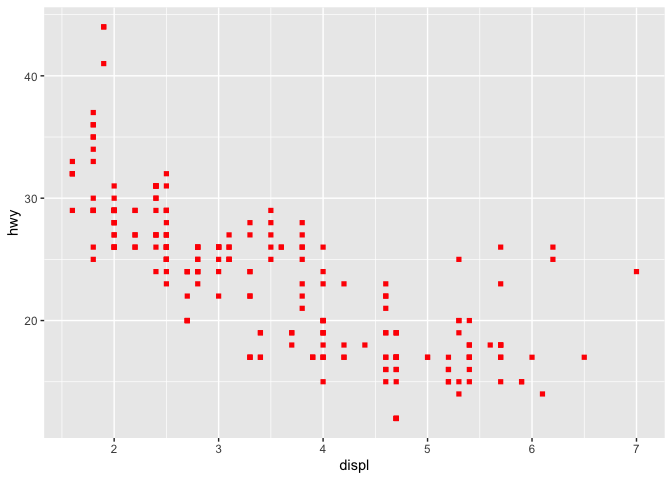
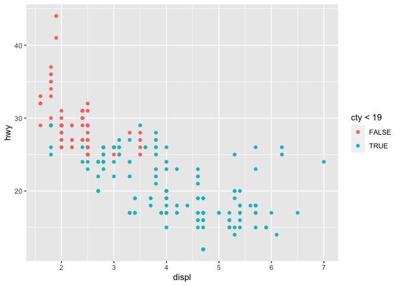
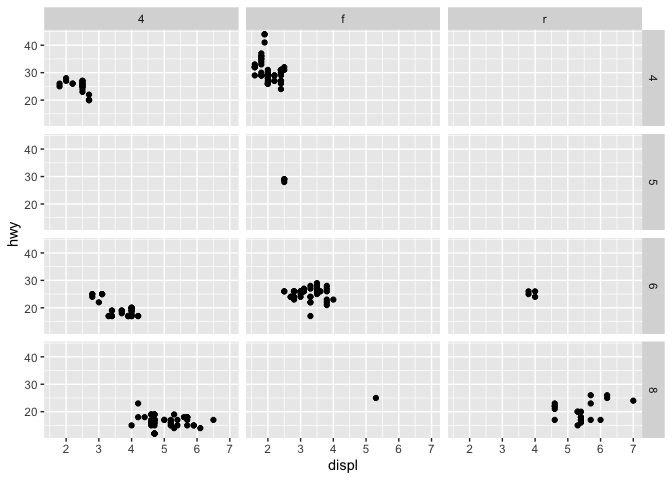
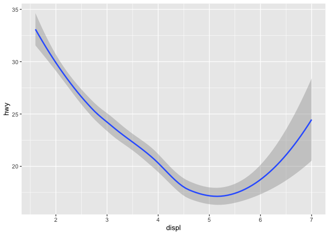
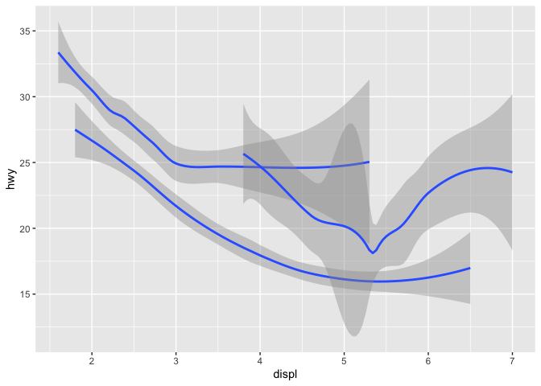
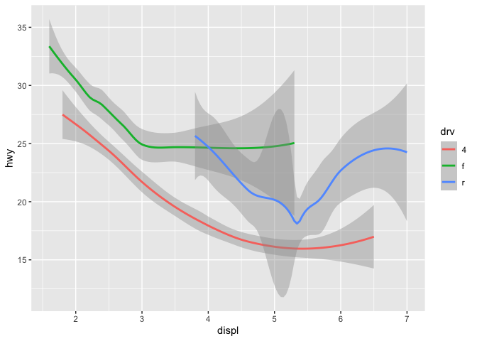
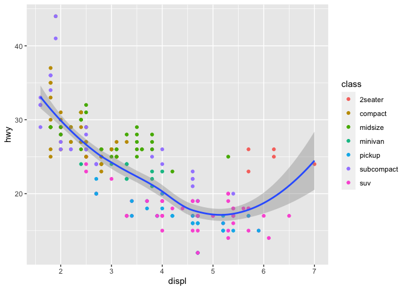
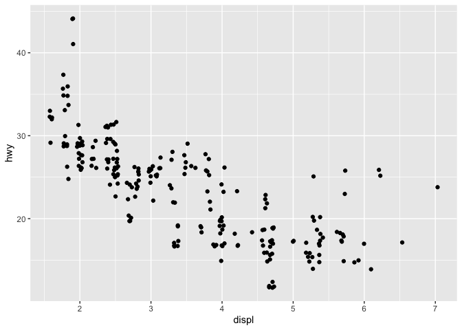
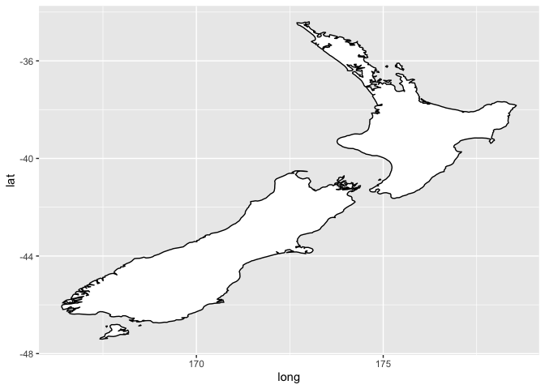
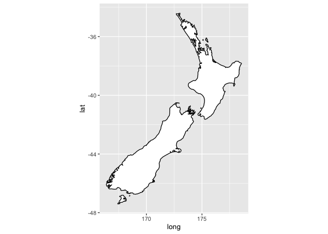

Data Visualization
================

<https://r4ds.had.co.nz/explore-intro.html>

The ggplot package can be used to visualize data. For example, the
ggplot comes with a preloaded tibble of miles per gallon information for
different cars.

``` r
library(tidyverse)
ggplot2::mpg
```

    ## # A tibble: 234 × 11
    ##    manufacturer model      displ  year   cyl trans drv     cty   hwy fl    class
    ##    <chr>        <chr>      <dbl> <int> <int> <chr> <chr> <int> <int> <chr> <chr>
    ##  1 audi         a4           1.8  1999     4 auto… f        18    29 p     comp…
    ##  2 audi         a4           1.8  1999     4 manu… f        21    29 p     comp…
    ##  3 audi         a4           2    2008     4 manu… f        20    31 p     comp…
    ##  4 audi         a4           2    2008     4 auto… f        21    30 p     comp…
    ##  5 audi         a4           2.8  1999     6 auto… f        16    26 p     comp…
    ##  6 audi         a4           2.8  1999     6 manu… f        18    26 p     comp…
    ##  7 audi         a4           3.1  2008     6 auto… f        18    27 p     comp…
    ##  8 audi         a4 quattro   1.8  1999     4 manu… 4        18    26 p     comp…
    ##  9 audi         a4 quattro   1.8  1999     4 auto… 4        16    25 p     comp…
    ## 10 audi         a4 quattro   2    2008     4 manu… 4        20    28 p     comp…
    ## # … with 224 more rows

-   **ggplot(data)**
    -   creates a coordinate system that you can add layers to.
    -   the data argument is the dataset to use in the graph.
    -   this function alone creates an empty graph.
-   **geom function**
    -   **geom**: the geometrical object used to represent data.
    -   adds a layer to the initial empty plot.
    -   takes a `mapping` argument that defines how variables in dataset
        are mapped to visual properties
        -   always paired with `aes(x, y)`, where x and y specify
            variables to map to the x and y axes
    -   **geom_point()**: adds a layer of points to plot, creating
        scatterplot

**TEMPLATE:**

``` r
ggplot(data = <DATA>) + <GEOM_FUNCTION>(mapping = aes(<MAPPINGS>))
```

**Aesthetic Mappings** \* can add third variable to 2d scatterplots by
mapping aesthetics to points \* eg. changing shape, size, color \*
**level**: aesthetic property \* implement using `aes()`: map the name
of the aesthetic to the variable \* eg.
`aes(x=displ, y=hwy, color=class)` \* if we try to map an ordered
aesthetic, eg. size, to an unordered variable, we will receive a
warning. \* Note: `aes()` is shorthand for aesthetic. Note that `x` and
`y` are themselves aesthetics. \* Aesthetic levels behave different for
categorical vs. continuous variables. \* Aesthetic examples \* **size**
\* **color** \* **alpha**: transparency \* **shape**: capped at 6
different shapes \* **stroke**: modify size of border for shapes with
border

**Manual Aesthetics** We can also set aesthetic properties of a graph
manually rather than leaving to be automatically chosen by ggplot. To do
so, specify the attribute in the arguments of the geom function
(**outside** of mapping).

-   **color** as a character string, eg. “blue”
-   **size** in mm
-   **shape** as a number – search online for number-to-shape chart

**Note**: aesthetics can map to expressions as well as pure variables,
eg. `color = displ < 5`.

Examples:

``` r
#mapping x, y, and mapping class to color levels
ggplot(data=mpg) + geom_point(mapping = aes(x=displ, y=hwy, color = class))
```

<!-- -->

``` r
#mapping x, y, and manually setting graph aesthetics
ggplot(data=mpg) + geom_point(mapping = aes(x=displ, y=hwy), color="red", shape=15)
```

<!-- -->

``` r
#mapping a transformed x, y, and displ
ggplot(data=mpg) + geom_point(mapping = aes(x=displ, y=hwy, color = cty < 19))
```

<!-- -->

## Facets

Facets split the plot into subplots that each display a different
variable. It’s an effective way to display multiple subsets of data.

-   **facet_wrap()**
    -   to facet plot by a single variable
    -   first argument is a formula created with \~ followed by variable
        name
        -   `facet-wrap(~ class)`
    -   can specify numbers of rows/columns using nrow/ncolumn argument
-   **facet_grid()**
    -   facet plots by two variables
    -   first argument is two variables separated by \~
        -   `facet_grid(cyl~drv)`
    -   can plot a single variable as a column by using . for second arg

Examples:

``` r
#faceting the graph into subplots for each class
ggplot(data = mpg) + geom_point(mapping = aes(x=displ, y=hwy)) + facet_wrap(~class, nrow=2)
```

<!-- -->

``` r
#faceting the graph into a grid
ggplot(data = mpg) + geom_point(mapping = aes(x=displ, y=hwy)) + facet_grid(cyl~drv)
```

<!-- -->

## Geometrical objects

Many geoms will represent multiple rows of data with a single
geometrical shape. For these geoms, assigning the `group` attribute in
`aes()` to a categorical variable lets you draw multiple objects. In
practice, assigning an attribute to a categorical aesthetic (eg. color)
does the same thing while also adding a legend, which is convenient.

``` r
#geom_smooth() is one example of a geom using a geometrical object
ggplot(data=mpg) + geom_smooth(mapping=aes(x=displ, y=hwy))
```

<!-- -->

``` r
#using the group attribute to divvy the data up by drive type
ggplot(data=mpg) + geom_smooth(mapping=aes(x=displ, y=hwy, group=drv))
```

<!-- -->

``` r
#using color to split the data up by drive type
ggplot(data=mpg) + geom_smooth(mapping=aes(x=displ, y=hwy, color=drv))
```

<!-- -->

## Using multiple geoms

You can easily add multiple layers to a single graph by using +.

``` r
ggplot(data=mpg) + geom_smooth(mapping=aes(x=displ, y=hwy)) +  geom_point(mapping=aes(x=displ, y=hwy))
```

However, in order to make code more efficient we can move the mapping
variable to ggplot. Including the mapping argument in geom function
calls will act as local override, allowing for different aesthetics in
multiple layers.

``` r
ggplot(data=mpg, mapping=aes(x=displ, y=hwy)) + geom_point(mapping=aes(color=class)) + geom_smooth()
```

<!-- -->

## Further Notes

-   **geom_jitter()** is equivalent to `geom_point(position="jitter")`.
    This jitters the points slighly out of their original position,
    which although detrimental at small scales is useful at large scales
    because it betters shows points that overlap.
-   Alternate Coordinate Systems
    -   **coord_quickmap()** sets the correct aspect ratio for maps,
        which is useful for spatial data.

``` r
#an example of jitter
ggplot(data=mpg) + geom_jitter(mapping = aes(x=displ, y=hwy))
```

<!-- -->

``` r
#an example of quickmap coordinates
nz <- map_data("nz")
#note messed up ratio
ggplot(nz, aes(long, lat, group = group)) +
  geom_polygon(fill = "white", colour = "black")
```

<!-- -->

``` r
#note accurate ratio
ggplot(nz, aes(long, lat, group = group)) +
  geom_polygon(fill = "white", colour = "black") +
  coord_quickmap()
```

<!-- -->
