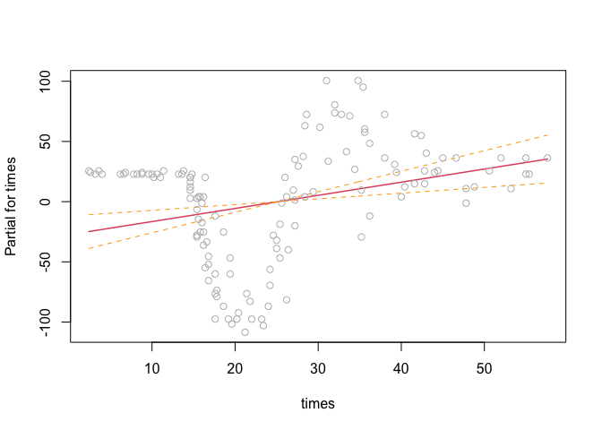
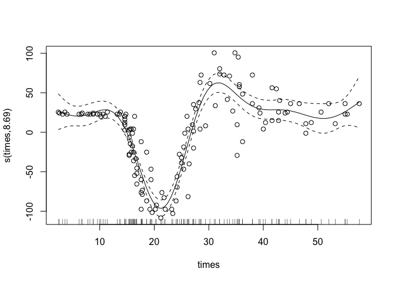
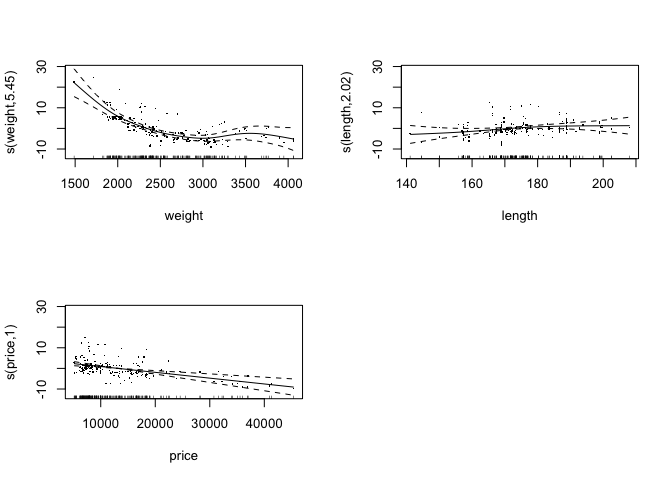
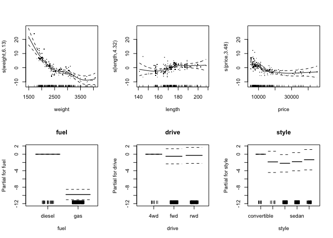
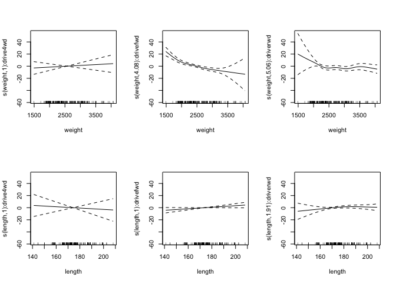
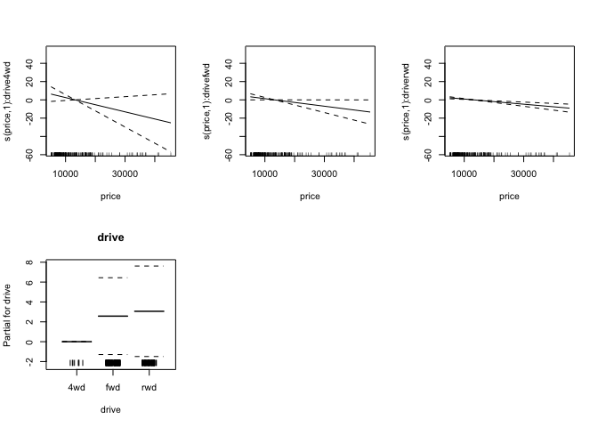
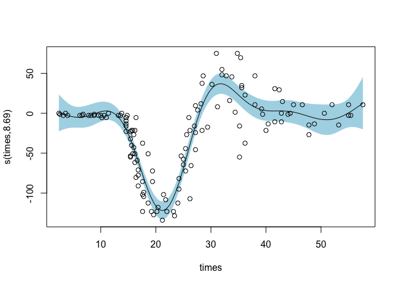
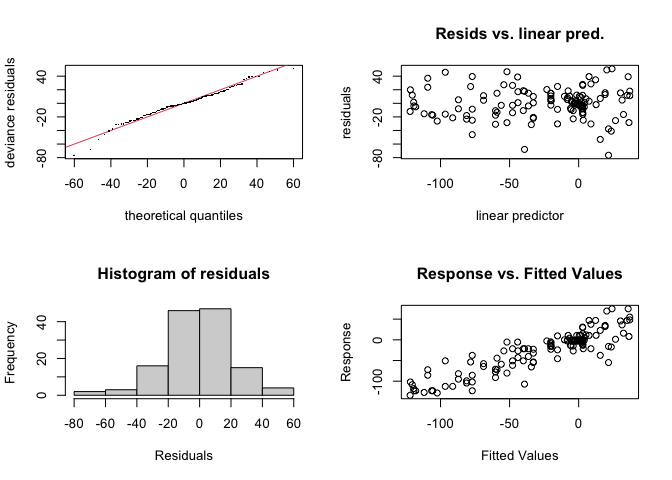

Modeling Techniques
================

-   BRTs
-   GLM
-   Linear Regression
-   Random Forest
-   MaxEnt
-   Artificial Neural Networks

# Linear and Logistic Regression

-   model finds best fit linear line between IV and DV
-   Linear regression provides continuous output, while logistic
    regression is best for discrete classification output (eg. yes/no)

### Example using tidymodels

``` r
example_logistic <- logistic_reg() |> set_engine("glm")

example_linear <- linear_reg() |>
  set_engine("lm") |>
  set_mode("regression")
```

### Example using motorcycle crash data

``` r
mcycle <- MASS::mcycle

#examine mcycle data frame 
head(mcycle)
```

    ##   times accel
    ## 1   2.4   0.0
    ## 2   2.6  -1.3
    ## 3   3.2  -2.7
    ## 4   3.6   0.0
    ## 5   4.0  -2.7
    ## 6   6.2  -2.7

``` r
plot(mcycle)
```

<!-- -->

``` r
#fit a linear model and plot it 
#note that se plots standard error
lm(accel ~ times, data=mcycle) |>
  termplot(partial.resid = TRUE, se = TRUE)
```

<!-- -->

# GAMs

<https://noamross.github.io/gams-in-r-course/>

GAMs are a middle ground between simple, highly interpretable models
(eg. linear models) and black-box machine learning. They can model
complex, nonlinear relationships but still retain clear information on
the structure of their predictions.

-   GAMs can fit data with **smooths/splines**, which are variably
    shaped functions
    -   smooths are made of many smaller **basis functions**
    -   the basis functions are summed together with varying weights
    -   this means that a single nonlinear relationship has several
        parameters, creating a more complex model than something linear
    -   coefficients for each variable can be extracted with the
        `coef()` function

### Example using motorcycle crash data

``` r
library(mgcv)
```

    ## Loading required package: nlme

    ## This is mgcv 1.8-39. For overview type 'help("mgcv-package")'.

``` r
library(ggplot2)
```

We can create a non-linear GAM model using mgcv’s `gam()` function. To
specify that we want to create a smooth relation between the IV and DV,
we encase the DV in the `s()` function.

``` r
# fit the model
gam_mod <- mgcv::gam(accel ~ s(times), data=mcycle)

# plot the results
plot(gam_mod, residuals=TRUE, pch = 1)
```

<!-- -->

``` r
# extract model coefficients
coef(gam_mod)
```

    ## (Intercept)  s(times).1  s(times).2  s(times).3  s(times).4  s(times).5 
    ##  -25.545865  -63.718008   43.475644 -110.350132  -22.181006   35.034423 
    ##  s(times).6  s(times).7  s(times).8  s(times).9 
    ##   93.176458   -9.283018 -111.661472   17.603782

`coef()` tells us that the smooth for times consists of 9 basis
functions, each with their own coefficient.

### Basis Functions and Smoothing

-   Since GAMs are so flexible, it is easy for them to become overfitted
    to the data. This makes smoothing important.
    -   **overfitting** is when the model is too finely tuned to noise
        and can’t adapt well to new data
    -   **fit = likelihood - *λ*⋅ wiggliness**
        -   finding the right *λ*, or **smoothing parameter**, is key
        -   GAMs can select their own smoothing parameter, be passed a
            specific value, or be given a method for selecting the best
            value.
        -   **REML: Restricted Maximum Likelihood** method is highly
            recommended.

``` r
# Setting a fixed smoothing parameter
gam(y ~ s(x), data = dat, sp = .1)
gam(y ~ s(x, sp = 0.1), data=dat)
# Smoothing via restricted maximum likelihood
gam(y ~s(x), data = dat, method = "REML")
```

-   A higher number of basis functions can also affect wiggliness

``` r
# Specifying number of basis functions
gam(y ~ s(x, k = 3), data = dat, method = "REML")
gam(y ~ s(x, k = 10), data = dat, method = "REML")
```

### Multivariate Regression with GAMs

``` r
# retrieving example data
library(gamair)
data("mpg", package="gamair")
```

-   We can add further variables to a model by adding them into the
    formula with a plus sign
    -   the GAM creates models for each variable and then adds them
        together

``` r
mod_city <- gam(city.mpg ~ s(weight) + s(length) + s(price), data=mpg, method = "REML")

plot(mod_city, residuals=TRUE, pages=1)
```

<!-- -->

-   Not every variable has to be wrapped in the `s()` smoothing function
    – can choose to evaluate them linearly instead
    -   in practice, all continuous variables are wrapped
    -   useful for categorical variables: creates a fixed effect for
        each level of the category

``` r
# Introducing categorical variables
mod_city2 <- gam(city.mpg ~ s(weight) + s(length) + s(price) + fuel + drive + style, data=mpg, method = "REML")

plot(mod_city2, all.terms = TRUE, residuals=TRUE, pages = 1)
```

<!-- -->

-   **Factor-smooth interaction** : GAM formulas can also fit different
    smooths for different categorical variables
    -   usually, also want to include a varying intercept in case the
        categories are different in overall means

``` r
# Using factor-smooth interaction
mod_city3 <- gam(city.mpg ~ s(weight, by=drive) + s(length, by=drive) + s(price, by=drive) + drive, data=mpg, method = "REML")

plot(mod_city3, residuals=TRUE, all.terms=TRUE, pages = 2)
```

<!-- --><!-- -->

### Interpreting GAMs

Use the `summary()` function to get a summary of model statistics.

``` r
summary(mod_city2)
```

    ## 
    ## Family: gaussian 
    ## Link function: identity 
    ## 
    ## Formula:
    ## city.mpg ~ s(weight) + s(length) + s(price) + fuel + drive + 
    ##     style
    ## 
    ## Parametric coefficients:
    ##                Estimate Std. Error t value Pr(>|t|)    
    ## (Intercept)     36.2359     1.6066  22.554   <2e-16 ***
    ## fuelgas         -9.7925     0.6267 -15.626   <2e-16 ***
    ## drivefwd        -0.5041     0.9216  -0.547   0.5851    
    ## driverwd        -0.2867     0.9678  -0.296   0.7674    
    ## stylehardtop    -1.8594     1.2883  -1.443   0.1507    
    ## stylehatchback  -2.2074     1.0607  -2.081   0.0388 *  
    ## stylesedan      -1.8152     1.1064  -1.641   0.1026    
    ## stylewagon      -1.3351     1.2374  -1.079   0.2820    
    ## ---
    ## Signif. codes:  0 '***' 0.001 '**' 0.01 '*' 0.05 '.' 0.1 ' ' 1
    ## 
    ## Approximate significance of smooth terms:
    ##             edf Ref.df      F p-value    
    ## s(weight) 6.135  7.341 12.600  <2e-16 ***
    ## s(length) 4.319  5.352  2.705  0.0202 *  
    ## s(price)  3.475  4.393  6.732   3e-05 ***
    ## ---
    ## Signif. codes:  0 '***' 0.001 '**' 0.01 '*' 0.05 '.' 0.1 ' ' 1
    ## 
    ## R-sq.(adj) =  0.879   Deviance explained = 89.1%
    ## -REML = 453.77  Scale est. = 5.0051    n = 201

-   **Family**: is model assuming a gaussian or normal distribution of
    errors?
-   **Link function:** How does the model transform predictions?
-   **Parametric coefficients:** gives coefficients, values, errors,
    etc. for linear terms in the formula
-   **Smooth terms:**
    -   **edf** - effective degrees of freedom, representing complexity
        of the smooth. 1 is linear, 2 is quadratic, etc.
    -   **Ref.df, F, p-value:** significance testing values.

### Visualizing GAMs

``` r
?plot.gam
```

plots generated by `mgcv::plot()` are **partial effect plots** that show
component effects of each term in the model.

``` r
# motorcycle model
plot(gam_mod,
     # select arg. lets you select what args to plot
     select = c(1),
     pages = 1, 
     # include linear and categorical terms
     # by default only smooth terms displayed
     all.terms = FALSE,
     # puts x values of data along bottom of plot
     rug = FALSE,
     # puts partial residuals on plots -- difference btwn partial effect and data 
     residuals = TRUE,
     pch = 1,
     cex = 1,
     # include standard error 
     se = TRUE,
     # use shading rather than lines to show se
     shade = TRUE,
     shade.col = "lightblue",
     # adds error of model intercept to better reflect overall uncertainty
     seWithMean = TRUE, 
     # shift scale by value of intercept
     # shows actual prediction of output (assuming avg value for other vars)
     shift = coef(gam_mod)[1])
```

<!-- -->

### Model Checking

We can check that we have a well-fit GAM using `gam.check()`

``` r
# checking the motorcycle model
gam.check(gam_mod)
```

<!-- -->

    ## 
    ## Method: GCV   Optimizer: magic
    ## Smoothing parameter selection converged after 8 iterations.
    ## The RMS GCV score gradient at convergence was 0.0009645413 .
    ## The Hessian was positive definite.
    ## Model rank =  10 / 10 
    ## 
    ## Basis dimension (k) checking results. Low p-value (k-index<1) may
    ## indicate that k is too low, especially if edf is close to k'.
    ## 
    ##            k'  edf k-index p-value
    ## s(times) 9.00 8.69    1.15    0.94

Ideal plot values: \* straight line \* evenly distributed around 0 \*
bell curve \* clustered around 1 to 1 line

-   **convergence**: we want the model to report finding full
    convergence. An unconverged model is probably wrong – too many
    parameters, not enough data.
-   **basis checking results**
    -   each line reports test results for 1 smooth
    -   k’ is the number of basis functions
    -   want larger p-values – small ones indicate too few basis
        functions

### Checking Concurvity

**Collinearity**: when two variables are strongly correlated, creating
problems with fitting the model. **Concurvity**: When one variable is a
smooth curve of another. This can create wild uncertainty in GAMs.

We can check for concurvity using the `concurvity(model, ...)` function.
This model has two modes.

-   **full = TRUE**
    -   Reports overall concurvity for each smooth \~ how much each
        smooth is predetermined by other functions.
    -   concern if worst case has high value (eg. > .8)

    ``` r
    concurvity(mod_city, full=TRUE)
    ```

        ##                  para s(weight) s(length)  s(price)
        ## worst    9.769453e-25 0.9384091 0.8924182 0.8835037
        ## observed 9.769453e-25 0.9208326 0.8162852 0.7926911
        ## estimate 9.769453e-25 0.8509137 0.7401133 0.6714852
-   **full = FALSE**
-   use if any values from `full=TRUE` are high
-   returns matrix of pairwise concurvities
-   can use to determine which vars have a close relationship

``` r
concurvity(mod_city, full=FALSE)
```

    ## $worst
    ##                   para    s(weight)    s(length)     s(price)
    ## para      1.000000e+00 9.890890e-26 6.876771e-27 5.349767e-25
    ## s(weight) 9.897019e-26 1.000000e+00 8.852302e-01 8.660358e-01
    ## s(length) 6.889670e-27 8.852302e-01 1.000000e+00 7.037612e-01
    ## s(price)  5.391847e-25 8.660358e-01 7.037612e-01 1.000000e+00
    ## 
    ## $observed
    ##                   para    s(weight)    s(length)     s(price)
    ## para      1.000000e+00 3.711191e-31 7.520422e-32 1.663358e-33
    ## s(weight) 9.897019e-26 1.000000e+00 8.067910e-01 7.625019e-01
    ## s(length) 6.889670e-27 8.106903e-01 1.000000e+00 5.430768e-01
    ## s(price)  5.391847e-25 8.185296e-01 6.917898e-01 1.000000e+00
    ## 
    ## $estimate
    ##                   para    s(weight)    s(length)     s(price)
    ## para      1.000000e+00 4.098771e-28 5.339695e-29 1.244130e-27
    ## s(weight) 9.897019e-26 1.000000e+00 7.264000e-01 6.339745e-01
    ## s(length) 6.889670e-27 7.270491e-01 1.000000e+00 4.488621e-01
    ## s(price)  5.391847e-25 7.316927e-01 5.487228e-01 1.000000e+00

# Regression Trees

<https://youtu.be/g9c66TUylZ4>
