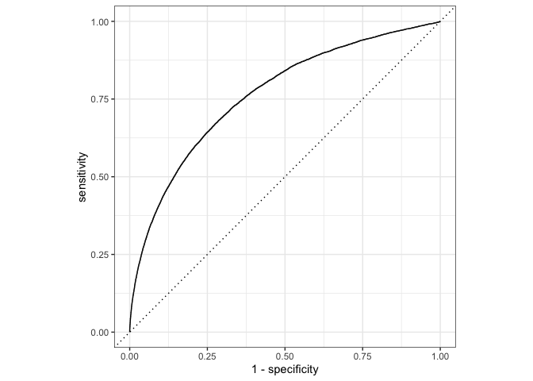

TidyModels Recipes
================

``` r
library(nycflights13) #for flight data
library(tidymodels) #primarily for recipes package
library(skimr) #for variable summaries
library(lubridate) #for converting from date-time to date
```

<https://www.tidymodels.org/start/recipes/>

The goal of this example exercise is to predict whether a plane arrives
more than 30 minutes late.

First, we make initial changes to the data.

``` r
#Setting a seed fixes random numbers to enable our analysis to be reproducible
set.seed(123)

flights_data <-
  nycflights13::flights |>
  #using mutate() to add new columns that are functions of prior ones
  mutate(
    #convert arrival delay to a factor
    #ifelse(condition, yes, no)
    arr_delay = ifelse(arr_delay >= 30, "late", "on_time"),
    #using factor() to transform the arr_delay vector into a factor
    arr_delay = factor(arr_delay),
    #converting date-time to just date
    date = lubridate::as_date(time_hour)
  ) |>
  #adding on weather data
  #inner_join adds rows from y to x based on if "key values" match 
  #in this case, weather data is matched to the departure origin/date
  dplyr::inner_join(nycflights13::weather, by=c("origin", "time_hour")) |>
  #only retain needed columns
  select(dep_time, flight, origin, dest, air_time, distance, carrier, 
         date, arr_delay, time_hour) |>
  #exclude missing data 
  na.omit() |>
  #when creating models, better to have qualitative be factors, not strings
  dplyr::mutate_if(is.character, as.factor)
```

Just for informative purposes, we can count how many flights arrive
late:

``` r
flights_data |>
  count(arr_delay) |>
  #count creates a tbl where the number of each occurence is titled n
  mutate(prop = n/sum(n))
```

    ## # A tibble: 2 × 3
    ##   arr_delay      n  prop
    ##   <fct>      <int> <dbl>
    ## 1 late       52540 0.161
    ## 2 on_time   273279 0.839

Note that 16% of flights were late.

Next, we can review our flight data.

``` r
glimpse(flights_data)
```

    ## Rows: 325,819
    ## Columns: 10
    ## $ dep_time  <int> 517, 533, 542, 544, 554, 554, 555, 557, 557, 558, 558, 558, …
    ## $ flight    <int> 1545, 1714, 1141, 725, 461, 1696, 507, 5708, 79, 301, 49, 71…
    ## $ origin    <fct> EWR, LGA, JFK, JFK, LGA, EWR, EWR, LGA, JFK, LGA, JFK, JFK, …
    ## $ dest      <fct> IAH, IAH, MIA, BQN, ATL, ORD, FLL, IAD, MCO, ORD, PBI, TPA, …
    ## $ air_time  <dbl> 227, 227, 160, 183, 116, 150, 158, 53, 140, 138, 149, 158, 3…
    ## $ distance  <dbl> 1400, 1416, 1089, 1576, 762, 719, 1065, 229, 944, 733, 1028,…
    ## $ carrier   <fct> UA, UA, AA, B6, DL, UA, B6, EV, B6, AA, B6, B6, UA, UA, AA, …
    ## $ date      <date> 2013-01-01, 2013-01-01, 2013-01-01, 2013-01-01, 2013-01-01,…
    ## $ arr_delay <fct> on_time, on_time, late, on_time, on_time, on_time, on_time, …
    ## $ time_hour <dttm> 2013-01-01 05:00:00, 2013-01-01 05:00:00, 2013-01-01 05:00:…

We will be using a logistic regression model to predict whether flights
will be on time. A logistic regression model is effective in
circumstances where we are predicting “yes/no”, so it’s important that
our outcome variable arr_delay is a factor rather than a string vector.

`flight` and `time_hour` are not predictor variables, but identification
variables that we can use to troubleshoot.

## Data Splitting

Next, we split the data into training and testing sets using `rsample`

``` r
set.seed(222)

data_split <- initial_split(flights_data, prob = 3/4)

train_data <- training(data_split)
test_data <- testing(data_split)
```

## Create Recipe and Roles

Note that many of these code snippets are building one completed code
segment.

Creating a recipe allows us to create some new predictors and conduct
any necessary pre-processing.

First, we initiate a recipe using `recipe(formula, data)`:

-   **Formula**: the variable on the left hand side of the tilde `~` is
    the model outcome, and the right side is predictors. Predictors can
    be listed by name, or the . can indicate all other variables as
    predictors.
-   **Data**: the data set used to create the model, which is typically
    the training data.

``` r
flights_rec <- recipe(arr_delay ~ ., data=train_data)
```

Next, we would like to indicate our id variables by updating their
roles. By using the update_role() function, the recipe will know that
those variables have a custom role and should not be included in the
model. This is useful because it allows us to keep the variables in the
data.

``` r
flights_rec <-
  recipe(arr_delay ~ ., data=train_data) |>
  update_role(flight, time_hour, new_role="ID")
#use summary to view current set of variables and roles
summary(flights_rec)
```

    ## # A tibble: 10 × 4
    ##    variable  type    role      source  
    ##    <chr>     <chr>   <chr>     <chr>   
    ##  1 dep_time  numeric predictor original
    ##  2 flight    numeric ID        original
    ##  3 origin    nominal predictor original
    ##  4 dest      nominal predictor original
    ##  5 air_time  numeric predictor original
    ##  6 distance  numeric predictor original
    ##  7 carrier   nominal predictor original
    ##  8 date      date    predictor original
    ##  9 time_hour date    ID        original
    ## 10 arr_delay nominal outcome   original

The date of the flight might affect arrival time. We can convert the
date column into useable figures by deriving info that might be more
important – day of the week, month, and holidays. This can be done by
adding steps to the recipe

``` r
flights_rec <-
  recipe(arr_delay ~ ., data=train_data) |>
  update_role(flight, time_hour, new_role="ID") |>
  #create two factor columns with appropriate day of the week and month
  step_date(date, features = c("dow", "month")) |>
  #create binary variable - is date a holdiay?
  step_holiday(date, holidays = timeDate::listHolidays("US"), 
               #deleting the original date column
               keep_original_cols = FALSE)
```

Finally, the simple logistic regression number requires entirely numeric
predictors. We can convert the nominal variables into **dummy
variables**: binary values for each level of the factor. R doesn’t
automatically make these, so we have to add it as a step.

``` r
flights_rec <-
  recipe(arr_delay ~ ., data=train_data) |>
  update_role(flight, time_hour, new_role="ID") |>
  step_date(date, features = c("dow", "month")) |>
  step_holiday(date, holidays = timeDate::listHolidays("US"), 
               keep_original_cols = FALSE) |>
  #note use of all_nominal_predictors()
  step_dummy(all_nominal_predictors)
```

Since `carrier` and `dest` have infrequently occuring factor values,
there might have been dummy variables created for values that don’t
exist in training set.

``` r
test_data |>
  distinct(dest) |>
  #returns rows with no match in test_data
  anti_join(train_data)
```

    ## Joining, by = "dest"

    ## # A tibble: 1 × 1
    ##   dest 
    ##   <fct>
    ## 1 LEX

This means that a dummy variable column that only contains zeros will be
created, aka a “zero-variance predictor” that contains no information
and might cause warnings and other issues. The final step here is to
remove zero variance predictors.

**FINAL RECIPE**

``` r
flights_rec <-
  recipe(arr_delay ~ ., data=train_data) |>
  update_role(flight, time_hour, new_role="ID") |>
  step_date(date, features = c("dow", "month")) |>
  step_holiday(date, holidays = timeDate::listHolidays("US"), 
               keep_original_cols = FALSE) |>
  step_dummy(all_nominal_predictors()) |>
  step_zv(all_predictors())
```

## Fitting a model with a recipe

Using the parsnip package, we first build a model specification.

``` r
lr_mod <-
  logistic_reg() |>
  set_engine("glm")
```

The model and recipe will be used together in several steps. This
process can be complicated, but we can simplify it with a **model
workflow**, which pairs and model and recipe together. This makes sense
because different models often need different recipes. We can use the
`workflows` package to bundle the model and recipe.

``` r
flights_wkf <-
  workflows::workflow() |>
  add_model(lr_mod) |>
  add_recipe(flights_rec)

flights_wkf
```

    ## ══ Workflow ════════════════════════════════════════════════════════════════════
    ## Preprocessor: Recipe
    ## Model: logistic_reg()
    ## 
    ## ── Preprocessor ────────────────────────────────────────────────────────────────
    ## 4 Recipe Steps
    ## 
    ## • step_date()
    ## • step_holiday()
    ## • step_dummy()
    ## • step_zv()
    ## 
    ## ── Model ───────────────────────────────────────────────────────────────────────
    ## Logistic Regression Model Specification (classification)
    ## 
    ## Computational engine: glm

``` r
#preparing the recipe and training the model with one function
flights_fit <-
  flights_wkf |> 
  fit(data = train_data)
```

`flights_fit` contains a finalized recipe and fitted model objects. We
can extract the model and recipe objects using `extract_fit_parsnip()`
and `extract_recipe()` respectively. We use the `broom::tidy()` function
to get a tidy result from the extracted model.

``` r
flights_fit |> extract_fit_parsnip() |> broom::tidy()
```

    ## # A tibble: 157 × 5
    ##    term                         estimate std.error statistic  p.value
    ##    <chr>                           <dbl>     <dbl>     <dbl>    <dbl>
    ##  1 (Intercept)                   7.28    2.73           2.67 7.64e- 3
    ##  2 dep_time                     -0.00166 0.0000141   -118.   0       
    ##  3 air_time                     -0.0440  0.000563     -78.2  0       
    ##  4 distance                      0.00507 0.00150        3.38 7.32e- 4
    ##  5 date_USChristmasDay           1.33    0.177          7.49 6.93e-14
    ##  6 date_USColumbusDay            0.724   0.170          4.25 2.13e- 5
    ##  7 date_USCPulaskisBirthday      0.807   0.139          5.80 6.57e- 9
    ##  8 date_USDecorationMemorialDay  0.585   0.117          4.98 6.32e- 7
    ##  9 date_USElectionDay            0.948   0.190          4.98 6.25e- 7
    ## 10 date_USGoodFriday             1.25    0.167          7.45 9.40e-14
    ## # … with 147 more rows

## Predicting using trained workflow

Now we can use the trained workflow to predict with our test data.

``` r
predict(flights_fit, test_data)
```

    ## # A tibble: 81,455 × 1
    ##    .pred_class
    ##    <fct>      
    ##  1 on_time    
    ##  2 on_time    
    ##  3 on_time    
    ##  4 on_time    
    ##  5 on_time    
    ##  6 on_time    
    ##  7 on_time    
    ##  8 on_time    
    ##  9 on_time    
    ## 10 on_time    
    ## # … with 81,445 more rows

We can retrieve actual probabilities using `type = "prob"` or by using
augment() to save both probabilities and predicted class.

``` r
flights_aug <-
  augment(flights_fit, test_data)

#Data look like:
flights_aug |> select(arr_delay, time_hour, flight, .pred_class, .pred_on_time)
```

    ## # A tibble: 81,455 × 5
    ##    arr_delay time_hour           flight .pred_class .pred_on_time
    ##    <fct>     <dttm>               <int> <fct>               <dbl>
    ##  1 on_time   2013-01-01 05:00:00   1545 on_time             0.945
    ##  2 on_time   2013-01-01 05:00:00   1714 on_time             0.949
    ##  3 on_time   2013-01-01 06:00:00    507 on_time             0.964
    ##  4 on_time   2013-01-01 06:00:00   5708 on_time             0.961
    ##  5 on_time   2013-01-01 06:00:00     71 on_time             0.962
    ##  6 on_time   2013-01-01 06:00:00    194 on_time             0.975
    ##  7 on_time   2013-01-01 06:00:00   1124 on_time             0.963
    ##  8 on_time   2013-01-01 05:00:00   1806 on_time             0.981
    ##  9 on_time   2013-01-01 06:00:00   1187 on_time             0.935
    ## 10 on_time   2013-01-01 06:00:00   4650 on_time             0.931
    ## # … with 81,445 more rows

We will evaluate the effectiveness of the model using the AUC-ROC curve
metric, computed using the yardstick() package.

``` r
#generating the roc curve
flights_aug |>
  #roc_curve(data, truth, ...) where ... is the predicted data
  roc_curve(truth=arr_delay, .pred_late) |>
  autoplot()
```

<!-- -->

``` r
#estimating area under the curve
flights_aug |>
  roc_auc(truth = arr_delay, .pred_late)
```

    ## # A tibble: 1 × 3
    ##   .metric .estimator .estimate
    ##   <chr>   <chr>          <dbl>
    ## 1 roc_auc binary         0.764
