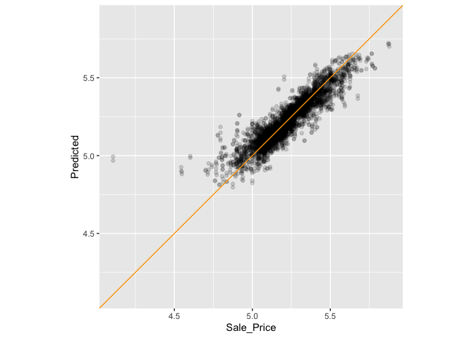

Improving Models - tmwr.org
================

Using the `rec`, `model`, `lm_wkf`, and `lm_fit` defined in
tmwr_basics.R

## Resampling for Evaluating Performance

-   usually, we need to understand the effectiveness of the model
    *before* the test set.
    -   **Idea**: use the training set

**Low Bias Models**

-   predictive models that can learn complex trends from data
-   high predictive capacity can sometimes mean that the model
    basicallly memorizes the training set.
    -   If we tried to evaluate the model using the training set, the
        results might be much higher than actual effectiveness.

**Re-predicting using the training set is generally a bad idea.**

### Example

``` r
# creating a random forest workflow 
rf <- workflow() |>
  add_formula(Sale_Price ~ Neighborhood + Gr_Liv_Area + Year_Built + Bldg_Type + Latitude + Longitude) |>
  add_model(rand_forest(trees = 1000, 
                        engine = "ranger", 
                        mode = "regression")) |>
  fit(data = training)

# Produces "apparent error rate" 
estimate_error <- function(model, data) {
  cl <- match.call()
  reg_metrics <- metric_set(rmse, rsq) 
  
  model |>
    predict(data) |>
    bind_cols(data |> select(Sale_Price)) |>
    reg_metrics(Sale_Price, .pred) |>
    select(-.estimator) |>
    mutate(object = as.character(cl$model),
           data = as.character(cl$data))
}

# estimating error rate for random forest using training data 
estimate_error(rf, training)
```

    ## # A tibble: 2 × 4
    ##   .metric .estimate object data    
    ##   <chr>       <dbl> <chr>  <chr>   
    ## 1 rmse       0.0347 rf     training
    ## 2 rsq        0.962  rf     training

``` r
estimate_error(lm_fit, training)
```

    ## # A tibble: 2 × 4
    ##   .metric .estimate object data    
    ##   <chr>       <dbl> <chr>  <chr>   
    ## 1 rmse       0.0710 lm_fit training
    ## 2 rsq        0.828  lm_fit training

Based on these results, `rf` is better at predicting sale prices - RMSE
is 2x better. However, when we apply random forest to the test set:

``` r
estimate_error(rf, testing)
```

    ## # A tibble: 2 × 4
    ##   .metric .estimate object data   
    ##   <chr>       <dbl> <chr>  <chr>  
    ## 1 rmse       0.0822 rf     testing
    ## 2 rsq        0.825  rf     testing

``` r
estimate_error(lm_fit, testing)
```

    ## # A tibble: 2 × 4
    ##   .metric .estimate object data   
    ##   <chr>       <dbl> <chr>  <chr>  
    ## 1 rmse       0.0873 lm_fit testing
    ## 2 rsq        0.799  lm_fit testing

The new estimate RMSE is much worse for random forest (which is
complex), and about the same for linear regression (which is simple).

## Resampling Methods

**V-fold cross validation**

``` r
set.seed(103)
ames_folds <- vfold_cv(training, v = 5, repeats = 2)
set.seed(NULL)
ames_folds
```

    ## #  5-fold cross-validation repeated 2 times 
    ## # A tibble: 10 × 3
    ##    splits             id      id2  
    ##    <list>             <chr>   <chr>
    ##  1 <split [1757/440]> Repeat1 Fold1
    ##  2 <split [1757/440]> Repeat1 Fold2
    ##  3 <split [1758/439]> Repeat1 Fold3
    ##  4 <split [1758/439]> Repeat1 Fold4
    ##  5 <split [1758/439]> Repeat1 Fold5
    ##  6 <split [1757/440]> Repeat2 Fold1
    ##  7 <split [1757/440]> Repeat2 Fold2
    ##  8 <split [1758/439]> Repeat2 Fold3
    ##  9 <split [1758/439]> Repeat2 Fold4
    ## 10 <split [1758/439]> Repeat2 Fold5

**Generating fits**

``` r
control <- control_resamples(save_pred = TRUE, save_workflow = TRUE) 

set.seed(87)
rf_res <- rf |>
  fit_resamples(resamples = ames_folds, control = control)

rf_res
```

    ## # Resampling results
    ## # 5-fold cross-validation repeated 2 times 
    ## # A tibble: 10 × 6
    ##    splits             id      id2   .metrics         .notes      .predictions   
    ##    <list>             <chr>   <chr> <list>           <list>      <list>         
    ##  1 <split [1757/440]> Repeat1 Fold1 <tibble [2 × 4]> <tibble [0… <tibble [440 ×…
    ##  2 <split [1757/440]> Repeat1 Fold2 <tibble [2 × 4]> <tibble [0… <tibble [440 ×…
    ##  3 <split [1758/439]> Repeat1 Fold3 <tibble [2 × 4]> <tibble [0… <tibble [439 ×…
    ##  4 <split [1758/439]> Repeat1 Fold4 <tibble [2 × 4]> <tibble [0… <tibble [439 ×…
    ##  5 <split [1758/439]> Repeat1 Fold5 <tibble [2 × 4]> <tibble [0… <tibble [439 ×…
    ##  6 <split [1757/440]> Repeat2 Fold1 <tibble [2 × 4]> <tibble [0… <tibble [440 ×…
    ##  7 <split [1757/440]> Repeat2 Fold2 <tibble [2 × 4]> <tibble [0… <tibble [440 ×…
    ##  8 <split [1758/439]> Repeat2 Fold3 <tibble [2 × 4]> <tibble [0… <tibble [439 ×…
    ##  9 <split [1758/439]> Repeat2 Fold4 <tibble [2 × 4]> <tibble [0… <tibble [439 ×…
    ## 10 <split [1758/439]> Repeat2 Fold5 <tibble [2 × 4]> <tibble [0… <tibble [439 ×…

``` r
# averages the resampling - for results per fold, use summarize = FALSE
collect_metrics(rf_res)
```

    ## # A tibble: 2 × 6
    ##   .metric .estimator   mean     n std_err .config             
    ##   <chr>   <chr>       <dbl> <int>   <dbl> <chr>               
    ## 1 rmse    standard   0.0707    10 0.00135 Preprocessor1_Model1
    ## 2 rsq     standard   0.831     10 0.00570 Preprocessor1_Model1

``` r
assess_res <- collect_predictions(rf_res)

assess_res
```

    ## # A tibble: 4,394 × 6
    ##    id      id2   .pred  .row Sale_Price .config             
    ##    <chr>   <chr> <dbl> <int>      <dbl> <chr>               
    ##  1 Repeat1 Fold1  5.07     3       5.06 Preprocessor1_Model1
    ##  2 Repeat1 Fold1  5.02     6       4.94 Preprocessor1_Model1
    ##  3 Repeat1 Fold1  5.10    10       5.09 Preprocessor1_Model1
    ##  4 Repeat1 Fold1  5.10    14       4.88 Preprocessor1_Model1
    ##  5 Repeat1 Fold1  5.17    16       5.04 Preprocessor1_Model1
    ##  6 Repeat1 Fold1  5.12    18       5.09 Preprocessor1_Model1
    ##  7 Repeat1 Fold1  4.97    28       5.08 Preprocessor1_Model1
    ##  8 Repeat1 Fold1  5.16    40       4.97 Preprocessor1_Model1
    ##  9 Repeat1 Fold1  5.06    46       5.11 Preprocessor1_Model1
    ## 10 Repeat1 Fold1  5.11    48       5.11 Preprocessor1_Model1
    ## # … with 4,384 more rows

``` r
assess_res |>
  ggplot(aes(x = Sale_Price, y = .pred)) +
  geom_point(alpha = .15) +
  geom_abline(color = "orange") +
  coord_obs_pred() +
  ylab("Predicted")
```

<!-- -->

By looking at the plot, there are two houses that are sig. overpredicted
by model \~ can determine which houses using `assess_res`

``` r
over_predicted <- assess_res |>
  mutate(residual = Sale_Price - .pred) |>
  arrange(desc(abs(residual))) |>
  slice(1:2)

training |>
  slice(over_predicted$.row) |>
  select(Gr_Liv_Area, Neighborhood, Year_Built, Bedroom_AbvGr, Full_Bath)
```

    ## # A tibble: 2 × 5
    ##   Gr_Liv_Area Neighborhood Year_Built Bedroom_AbvGr Full_Bath
    ##         <int> <fct>             <int>         <int>     <int>
    ## 1         832 Old_Town           1923             2         1
    ## 2         832 Old_Town           1923             2         1
